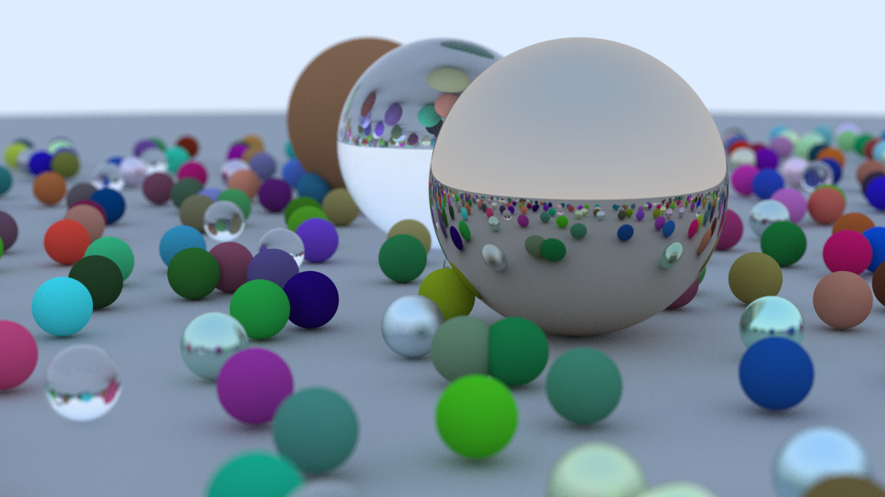

{: .box-success}
Over the summer, I took on a personal project that really pushed the boundaries of what I’d done in software development: I built a simple 3D ray tracing engine in Java. You can check out the code on [GitHub](https://github.com/pblood66/RayTracer). It’s a proof-of-concept renderer that produces basic 3D images by simulating how rays of light interact with spheres and materials.

*This is currently where the project is at. All of this was simulated on my computer!*

At first glance, ray tracing sounds intimidating. It’s a core graphics technique used in everything from Pixar movies to real-time rendering engines, and it involves a fair amount of math and computer science concepts like vectors, recursion, and material shading. But tackling it as a project gave me a chance to level up in so many areas, not just graphics, but software structure and development habits too. 

While researching for this project, I quickly learned about various rendering techniques. The one I was most interested in was path tracing. Path tracing, the foundations for modern ray tracing was first conceived in the late 80's. At the time, this algorithm was way too computationally heavy for rendering. As time progressed and computers became faster it has since regained popularity in its usage. In 2000, the ASCI White supercomputer had a theoretical processing speed of 12.3 trillion computations a second[^1]. Today, modern GPU's are capable of 35 trillion computations a second[^2].

## What the Engine Does

The renderer works by casting rays from a virtual camera through each pixel of the image plane. Each ray is tested for intersections with scene objects (currently spheres), and the closest hit determines how the pixel color is computed. I implemented ray–object intersection logic using vector equations and used this as the foundation for shading and material behavior.

The output is written to the PPM image format, which kept the focus on rendering logic rather than file-handling complexity. This also made it easier to inspect intermediate results and debug visual artifacts during development.

### Materials and Light Interaction

To simulate different surface properties, I implemented multiple material models:

- Lambertian (diffuse) materials scatter incoming rays randomly to approximate matte surfaces.

- Metal materials reflect rays with controllable fuzziness to simulate imperfect reflection.

- Dielectric materials handle refraction and reflection using Snell’s Law and Schlick’s approximation.

Each material encapsulates its own scatter behavior, which helped keep the rendering logic modular and extendable. This design choice made it easier to experiment with different material behaviors without rewriting the core ray traversal code.

## What I Learned

### Software Structure and Organization

Building a renderer from scratch forced me to think carefully about how to organize code. I broke the project into logical components like rays, vectors, materials, and scene objects, which made the codebase easier to understand and extend. This was a big step up from smaller, single-file programs.

### Math in Practice

Ray tracing relies heavily on vector math and geometric reasoning. Implementing these concepts in code helped solidify ideas like dot products, normalization, and reflection in a way that felt practical instead of abstract.

### Debugging 

One of the biggest challenges was debugging. When something went wrong, the program didn’t crash — it just produced strange images. Learning how to isolate issues by testing individual parts of the rendering pipeline taught me to be more patient and methodical when debugging complex systems.

### Iteration and Refinement

This project evolved over time. I started with basic ray-object intersections and gradually added materials, shading, and scene complexity. That incremental approach helped me learn how to build systems that grow without becoming unmanageable.

## What the Future Holds?

Currently, my program is pretty slow especially if I were to render images in HD (that's over 2 million pixels). In the future I would like to render images much faster using axis aligned bounding boxes (AABB) and a bounding volume hierarchy (BVH) algorithm. These algorithms would reduce the computation cost per pixel. I also believe that utilizing a GPU would also greatly help with runtimes. This project would be perfect for CUDA programming and utilizing the GPU. In the current implementation, the CPU is doing all of the computations however, a GPU is much more suited for ray tracing computations.

I would also like to move away from using ppm files. Initially, I chose to use a ppm file as my output, it is rather clunky and there are just better options. Ideally, I want to move away from image formats as I would like to render scenes closer to real time. This would mean building a better UI and minimizing rendering runtimes as much as possible. 

I've learned so much from this project, however there is still a lot of improvements that I would like to make that will not only expand the functionality of this project but also my own toolset as a programmer. This project has been a lot of fun but for now I will be moving on to other projects. I do plan on returning this engine so stay tuned for future updates!

[^1]: [ASCI WHITE](https://en.wikipedia.org/wiki/ASCI_White) wikipedia.org. Retrieved December 26, 2025
[^2]: [Geforce RTX 3090](https://www.techpowerup.com/gpu-specs/geforce-rtx-3090.c3622) TechPowerUp. Retrieved December 26, 2025