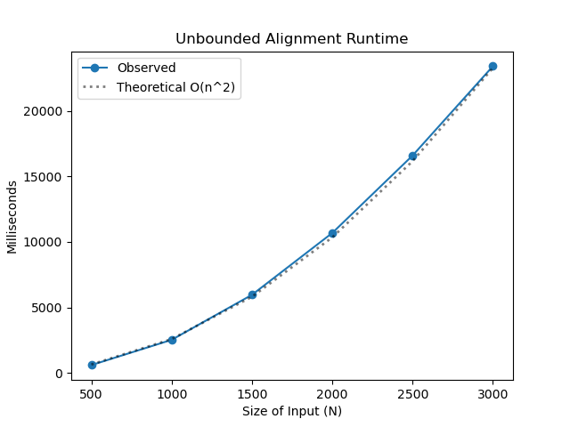
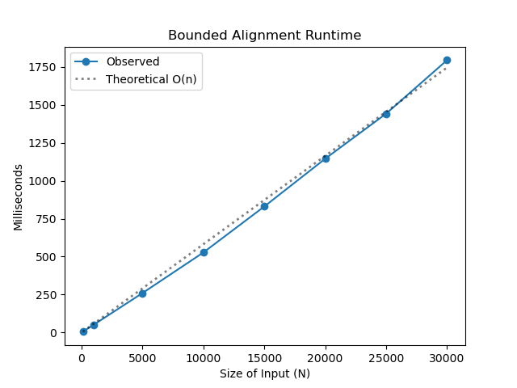

# Project Report - Alignment

## Baseline

### Design Experience

For my design experience, I met with Tyler.

During our discussion we talked about:
- how does the alignment algorithm work?
  - when would it be an indel, sub, or match?
    - use the min/max functions
- data structures we will use?
  - matrix vs a dictionary
    - matrix easy to implement for baseline but will make core difficult
  - build an Aligner class
    - don't need to pass a bunch of parameters for global functions

### Theoretical Analysis - Unrestricted Alignment

I make the assumption that both sequences, `seq1` and `seq2` are of the same length. This means that instead of
looking at complexity in terms of n and m, I will only use n.

#### Time 
##### __init__
```python
def __init__(self, seq1, seq2, match_award, indel_penalty, sub_penalty, gap_width=-1):
    self.alignment_table = dict()                                                           # O(1) - assigning is constant
    self.traceback_table = dict()                                                           # O(1) - assigning is constant
    self.seq1 = seq1                                                                        # O(1) - assigning is constant
    self.seq2 = seq2                                                                        # O(1) - assigning is constant
    self.match_award = match_award                                                          # O(1) - assigning is constant
    self.indel_penalty = indel_penalty                                                      # O(1) - assigning is constant
    self.sub_penalty = sub_penalty                                                          # O(1) - assigning is constant
    self.gap_width = gap_width                                                              # O(1) - assigning is constant
```
The constructor is just setting up the alignment and traceback tables and saving important variables. All of these operations
are done in constant time.

Overall, `__init__` is **O(1)** time complexity


##### calculate_square
```python
def calculate_square(self, x, y):
    # base cases
    if (x, y) == (0, 0):                                                                # O(1) - comparison is constant
        self.alignment_table[(x, y)] = 0                                                # O(1) - creating new key-value pair is constant
        self.traceback_table[(x, y)] = Trace.ORIGIN                                     # O(1) - creating new key-value pair is constant
        return
    if x == 0:                                                                          # O(1) - comparison is constant
        self.alignment_table[(x, y)] = y * self.indel_penalty                           # O(1) - creating new key-value pair is constant
        self.traceback_table[(x, y)] = Trace.UP                                         # O(1) - creating new key-value pair is constant
        return
    if y == 0:                                                                          # O(1) - comparison is constant
        self.alignment_table[(x, y)] = x * self.indel_penalty                           # O(1) - creating new key-value pair is constant
        self.traceback_table[(x, y)] = Trace.LEFT                                       # O(1) - creating new key-value pair is constant
        return
    
    def get(i, j):                                                                  # O(1) - get is constant
        return self.alignment_table.get((i, j), math.inf)                               # O(1) - dict get and return is constant

    diagonal_score = get(x - 1, y - 1)                                                  # O(1) - get score is constant
    top_score = get(x, y - 1)                                                           # O(1) - get score is constant
    left_score = get(x - 1, y)                                                          # O(1) - get score is constant
    
    seq1_char = self.seq1[y - 1]                                                        # O(1) - assigning is constant
    seq2_char = self.seq2[x - 1]                                                        # O(1) - assigning is constant

    if seq1_char == seq2_char:                                                          # O(1) - comparison is constant
        diagonal_score += self.match_award                                              # O(1) - addition is constant
    else:
        diagonal_score += self.sub_penalty                                              # O(1) - addition is constant

    top_score += self.indel_penalty                                                     # O(1) - addition is constant
    left_score += self.indel_penalty                                                    # O(1) - addition is constant

    self.alignment_table[(x, y)] = min(diagonal_score, top_score, left_score)           # O(1) - number of items min compares is constant

    if self.alignment_table[(x, y)] == diagonal_score:                                  # O(1) - comparison is constant
        self.traceback_table[(x, y)] = Trace.DIAG                                       # O(1) - creating new key-value pair is constant
    elif self.alignment_table[(x, y)] == left_score:                                    # O(1) - comparison is constant
        self.traceback_table[(x, y)] = Trace.LEFT                                       # O(1) - creating new key-value pair is constant
    else:
        self.traceback_table[(x, y)] = Trace.UP                                         # O(1) - creating new key-value pair is constant
```
`calculate_square` is used to find the cost of a square at a particular point on the table. No matter how large `n` gets, 
`calculate_square` will always have the same number of operations done. Therefore, it is constant.

Overall, `calculate_square` is **O(1)** time complexity

##### fill_table
```python
def fill_table(self):
    for i in range(1, len(self.seq2) + 1):                  # loop 1
        for j in range(1, len(self.seq1) + 1):              # loop 2
            self.calculate_square(i, j)                     # O(1) - calculate_square is constant
```

`fill_table` has two loops. Loop 1 iterates over the length of `n`. Loop 2 iterates over the length of `n`. Because loop 2
is nested inside of the first loop, for each iteration in loop 1, it runs `calculate_square` `n` times.

Overall, `fill_table` is **O(n^2)** time complexity

##### get_score
```python
def get_score(self):
    return self.alignment_table[(len(self.seq2), len(self.seq1))]       # O(1) - dict lookup is constant
```

To get the final score, the function finds the entry in the very bottom right of the table and looks it up in the 
alignment table. Dictionary lookup is constant. Therefore, `get_score` is **O(1)** time complexity

##### get_traceback
```python
def get_traceback(traceback, seq1, seq2):
    aseq1 = ""                                  # O(1) - assigning is constant
    aseq2 = ""                                  # O(1) - assigning is constant

    x = len(seq2)                               # O(1) - assigning is constant
    y = len(seq1)                               # O(1) - assigning is constant
    while (x, y) != (0, 0):                     # loop 1
        if traceback[(x,y)] == Trace.DIAG:      # O(1) - comparison is constant
            x -= 1                              # O(1) - decrement is constant
            y -= 1                              # O(1) - decrement is constant
            aseq1 += seq1[y]                    # O(1) - string concat is constant
            aseq2 += seq2[x]                    # O(1) - string concat is constant
        elif traceback[(x,y)] == Trace.UP:      # O(1) - comparison is constant
            y -= 1                              # O(1) - decrement is constant
            aseq1 += seq1[y]                    # O(1) - string concat is constant
            aseq2 += '-'                        # O(1) - string concat is constant
        else:
            x -= 1                              # O(1) - decrement is constant
            aseq1 += "-"                        # O(1) - string concat is constant
            aseq2 += seq2[x]                    # O(1) - string concat is constant

    return aseq1[::-1], aseq2[::-1]             # O(n) - reversing a string is linear
```
`get_traceback` has one main loop that iterates through the traceback table backwards. In the worst case scenario traceback,
the optimal path will go straight up and then left or go straight left and then up. The length of this traceback is `2n`. 
Therefore, loop 1 will run in O(n + m) time.

This traceback would create two strings that only has indels. This would make the len of `aseq1` and `aseq2` would both have
a length of `2n`. These strings then need to be reversed. In order to reverse a string, it must iterate through each character in the string
but backwards. This means that reversing the strings runs in O(n) time. 

Overall, `get_traceback` has three operations that take O(n) time. Therefore, it runs in **O(n)** time complexity

##### align

```python
def align(
        seq1: str,
        seq2: str,
        match_award=-3,
        indel_penalty=5,
        sub_penalty=1,
        banded_width=-1,
        gap_open_penalty=0,
        gap='-',
) -> tuple[float, str | None, str | None]:
    aligner = Aligner(seq1, seq2, match_award, indel_penalty, sub_penalty, banded_width)    # O(1) - constructor is constant
    aligner.fill_table()                                                                    # O(n^2)

    aseq1, aseq2 = get_traceback(aligner.traceback_table, seq1, seq2)                       # O(n) - get_traceback is linear

    return aligner.get_score(), aseq1, aseq2                                                # O(1) - get score and returning is constant
```

Filling the table dominates the rest of the function. Overall, the time complexity for `align` is **O(n^2)**.

#### Space

##### __init__
```python
def __init__(self, seq1, seq2, match_award, indel_penalty, sub_penalty, gap_width=-1):
    self.alignment_table = dict()                                                           # O(1) - will grow to be n * m entries
    self.traceback_table = dict()                                                           # O(1) - will grow to be n * m entries
    self.seq1 = seq1                                                                        # O(1) - assigning is constant
    self.seq2 = seq2                                                                        # O(1) - assigning is constant
    self.match_award = match_award                                                          # O(1) - assigning is constant
    self.indel_penalty = indel_penalty                                                      # O(1) - assigning is constant
    self.sub_penalty = sub_penalty                                                          # O(1) - assigning is constant
    self.gap_width = gap_width                                                              # O(1) - assigning is constant
```
All of the operations in the constructor are constant space. However it is important to note that the alignment and 
traceback tables will eventually grow to have `n * n` total key-pair values. 

Overall, `__init__` is **O(1)** space complexity.

##### calculate_square
```python
def calculate_square(self, x, y):
    # base cases
    if (x, y) == (0, 0):
        self.alignment_table[(x, y)] = 0                                        # O(1) - creates one new key value pair entry
        self.traceback_table[(x, y)] = Trace.ORIGIN                             # O(1) - creates one new key value pair entry
        return
    if x == 0:
        self.alignment_table[(x, y)] = y * self.indel_penalty                   # O(1) - creates one new key value pair entry
        self.traceback_table[(x, y)] = Trace.UP                                 # O(1) - creates one new key value pair entry
        return
    if y == 0:
        self.alignment_table[(x, y)] = x * self.indel_penalty                   # O(1) - creates one new key value pair entry
        self.traceback_table[(x, y)] = Trace.LEFT                               # O(1) - creates one new key value pair entry
        return

    def get(i, j):                                                              # O(1) - get is constant
        return self.alignment_table.get((i, j), math.inf)                       # O(1) - dict get and return is constant

    diagonal_score = get(x - 1, y - 1)                                          # O(1) - get score is constant
    top_score = get(x, y - 1)                                                   # O(1) - get score is constant
    left_score = get(x - 1, y)                                                  # O(1) - get score is constant

    seq1_char = self.seq1[y - 1]                                                # O(1) - assigning is constant
    seq2_char = self.seq2[x - 1]                                                # O(1) - assigning is constant

    if seq1_char == seq2_char:
        diagonal_score += self.match_award                                      # O(1) - doesn't create a new variable
    else:
        diagonal_score += self.sub_penalty                                      # O(1) - doesn't create a new variable

    top_score += self.indel_penalty                                             # O(1) - doesn't create a new variable
    left_score += self.indel_penalty                                            # O(1) - doesn't create a new variable

    self.alignment_table[(x, y)] = min(diagonal_score, top_score, left_score)   # O(1) - creates one new key value pair entry

    if self.alignment_table[(x, y)] == diagonal_score:
        self.traceback_table[(x, y)] = Trace.DIAG                               # O(1) - creates one new key value pair entry
    elif self.alignment_table[(x, y)] == left_score:
        self.traceback_table[(x, y)] = Trace.LEFT                               # O(1) - creates one new key value pair entry
    else:
        self.traceback_table[(x, y)] = Trace.UP                                 # O(1) - creates one new key value pair entry
```
`calculate_square` no matter the size of `n`, will always make one new key value pair for the alignment and traceback tables. 
All of the other operations are local variables that don't increase in size as `n` gets larger. 

Overall, `calculate_square` is **O(1)** space complexity.


##### fill_table
```python
def fill_table(self):
    for i in range(len(self.seq2) + 1):                     # Loop 1
        for j in range(len(self.seq1) + 1):                 # Loop 2
            self.calculate_square(i, j)                     # O(1) - calculate square is constant space
```

Loop 2 iterates n times and is nested within loop 1 which iterates m times. For each iteration, it runs calculate square,
which creates 2 new dictionary entries that get added to alignment and traceback tables. In order to run, `fill_tables`
will create $2n^2$ dictionary entries. 

Overall, `fill_tables` is **O(n^2)** space complexity


##### get_score
```python
def get_score(self):
    return self.alignment_table[(len(self.seq2), len(self.seq1))]   # O(1) - space is constant
```

Overall, `get_score` is **O(1)** space complexity


##### get_traceback
```python
def get_traceback(traceback, seq1, seq2):
    aseq1 = ""                                      # O(n) - will grow to be n + n chars worst case 
    aseq2 = ""                                      # O(n) - will grow to be n + n chars worst case

    x = len(seq2)                                   # O(1) - assigning is constant
    y = len(seq1)                                   # O(1) - assigning is constant
    while (x, y) != (0, 0):
        if traceback[(x,y)] == Trace.DIAG:
            x -= 1
            y -= 1
            aseq1 += seq1[y]
            aseq2 += seq2[x]
        elif traceback[(x,y)] == Trace.UP:
            y -= 1
            aseq1 += seq1[y]
            aseq2 += '-'
        else:
            x -= 1
            aseq1 += "-"
            aseq2 += seq2[x]

    return aseq1[::-1], aseq2[::-1]
```
When going through the traceback table, `aseq1` and `aseq1` will grow in size. The maximum size is if the optimal solution
is only using indels. This would mean that the size of the strings would be n + n. For example, if `seq1`= "abcde" and `seq2` = "vwxyz",
and the solution is "-----abcde" and "vwxyz-----" (somehow). the traceback strings would be of length equal to n + n.
In most cases however, this will not be the optimal solution so the actual size of both is going to be less. 

Overall, `get_traceback` is **O(n)** space complexity

##### align

```python
def align(
        seq1: str,
        seq2: str,
        match_award=-3,
        indel_penalty=5,
        sub_penalty=1,
        banded_width=-1,
        gap_open_penalty=0,
        gap='-',
) -> tuple[float, str | None, str | None]:
    aligner = Aligner(seq1, seq2, match_award, indel_penalty, sub_penalty, banded_width)    # O(1)
    aligner.fill_table()                                                                    # O(n^2)

    aseq1, aseq2 = get_traceback(aligner.traceback_table, seq1, seq2)                       # O(n)
        
    return aligner.get_score(), aseq1, aseq2                                                # O(1)
```
`fill_table` dominates the space complexity for `align`. This is largely because it has created two tables that are
both size mn. This means that as m and n increase, they will control the magnitude of space required to store all the information.

Overall, `align` is **O(n^2)** space complexity

### Empirical Data - Unrestricted Alignment

| N    | time (ms) |
|------|-----------|
| 500  | 603.00    |
| 1000 | 2,530.18  |
| 1500 | 5966.36   |
| 2000 | 10686.94  |
| 2500 | 16599.37  |
| 3000 | 23416.14  |


### Comparison of Theoretical and Empirical Results - Unrestricted Alignment

- Theoretical order of growth: **O(mn)** -> **O(n^2)** *because we assume both sequences are size `n`
- Theoretical constant of proportionality: 0.00258
- Empirical order of growth (if different from theoretical): 




My theoretical analysis matches the empirical data that I collected.

## Core

### Design Experience

For my design experience, I met with Tyler.

During our discussion we talked about:
- calculating the banded area
- what changes we needed to make to the `align` function to also include banded functionality. 
  - adding a separate method?
- theoretical runtimes of the banded alignment vs unrestricted alignment
  - what effect does the `gap_width` have on the time and space complexity?


### Theoretical Analysis - Banded Alignment

With a banded alignment implementation, there is a new variable that can effect the time and space complexity of the algorithm.
I will use `k` to represent the band width size. 

#### Time 

##### fill_table
```python
def fill_table(self):
    if self.gap_width == -1:                                        # baseline
        for i in range(len(self.seq2) + 1):                         # baseline
            for j in range(len(self.seq1) + 1):                     # baseline
                self.calculate_square(i, j)                         # baseline
    else:                                                           # core
        for i in range(len(self.seq2) + 1):                         # loop 1
            start_j = max(0, i - self.gap_width)                    # O(1) - max is constant because there are only two items
            end_j = min(len(self.seq1), i + self.gap_width)         # O(1) - min is constant because there are only two items

            for j in range(start_j, end_j + 1):                     # loop 2
                self.calculate_square(i, j)                         # O(1) - calculate_square is constant
```
The biggest change that was made to fill a banded table was how `fill_table` iterates through the alignment table. Loop 1
is the same as the unbounded alignment algorithm. It then calculates the start and end indices of the banded area for that
value of `i`. We then find that loop 2 will iterate over the difference of `start_j` and `end_j` which is 2 * `k`.
Therefore, loop 1 and 2 take a total of 2 * `k` * `n` iterations.

Overall, `fill_tables` is **O(kn)** time complexity


##### align
```python
def align(
        seq1: str,
        seq2: str,
        match_award=-3,
        indel_penalty=5,
        sub_penalty=1,
        banded_width=-1,
        gap_open_penalty=0,
        gap='-',
) -> tuple[float, str | None, str | None]:
    aligner = Aligner(seq1, seq2, match_award, indel_penalty, sub_penalty, banded_width)    # O(1) - constructor is constant
    aligner.fill_table()                                                                    # O(kn) - fill_table

    score = aligner.get_score()                                                             # O(1) - get score is constant
    if score == math.inf:                                                                   # O(1) - comparison is constant
        return math.inf, None, None                                                         # O(1) - returning is constant
    aseq1, aseq2 = get_traceback(aligner.traceback_table, seq1, seq2)                       # O(n) - get_traceback

    return score, aseq1, aseq2                                                              # O(1) - returning is constant
```
In the `align` function, `fill_table` dominates the runtime in most cases. The exceptions would be when k is very low, like close to one.
At that point, the traceback function could dominate for very large values of m. However, this is not very practical as
a `gap_width` of 1 would not provide very useful information. 

Overall, `align` is **O(kn)** time complexity

#### Space

##### fill_table
```python
def fill_table(self):
    if self.gap_width == -1:                                        # baseline
        for i in range(len(self.seq2) + 1):                         # baseline
            for j in range(len(self.seq1) + 1):                     # baseline
                self.calculate_square(i, j)                         # baseline
    else:                                                           # core
        for i in range(len(self.seq2) + 1):                         # loop 1
            start_j = max(0, i - self.gap_width)                    # O(1) - variable updates
            end_j = min(len(self.seq1), i + self.gap_width)         # O(1) - variable updates

            for j in range(start_j, end_j + 1):                     # loop 2
                self.calculate_square(i, j)                         # O(1) - calculate_square is constant space
```
Loop 1 iterates over all of the length of `seq2` which is size n. Loop 2 however will iterate k times. This means that
`fill_table` will run `calculate_square` kn times. Calculating the score of a square was already determined to create two
dictionary entries. This means that there are 2kn entries made. 

Overall, `fill_table` is **O(kn)** space complexity


##### align
```python
def align(
        seq1: str,
        seq2: str,
        match_award=-3,
        indel_penalty=5,
        sub_penalty=1,
        banded_width=-1,
        gap_open_penalty=0,
        gap='-',
) -> tuple[float, str | None, str | None]:
    aligner = Aligner(seq1, seq2, match_award, indel_penalty, sub_penalty, banded_width)                # O(1) - constructor is constant space
    aligner.fill_table()                                                                                # O(kn) - fill_table

    score = aligner.get_score()                                                                         # O(1) - assigning is constant
    if score == math.inf:               
        return math.inf, None, None 
    aseq1, aseq2 = get_traceback(aligner.traceback_table, seq1, seq2)                                    # O(n) - traceback


    return score, aseq1, aseq2
```

The function `fill_table` fills out an alignment table and a traceback table. Both of these tables are size kn.
These two tables will dominate the space complexity.

Overall, `align` has a space complexity of **O(kn)**

### Empirical Data - Banded Alignment

| N     | k  | time (ms) |
|-------|:---|-----------|
| 100   | 15 | 5.02      |
| 1000  | 15 | 51.67     |
| 5000  | 15 | 260.11    |
| 10000 | 15 | 527.70    |
| 15000 | 15 | 830.71    |
| 20000 | 15 | 1145.52   |
| 25000 | 15 | 1442.57   |
| 30000 | 15 | 1794.93   |

### Comparison of Theoretical and Empirical Results - Banded Alignment

We assume that k is a fixed number. Therefore, we can decide that k is constant and the order of growth is linear.

- Theoretical order of growth: O(kn) -> **O(n)**
- Theoretical constant of proportionality: 0.0546
- Empirical order of growth (if different from theoretical): 




My theoretical order of growth closely matches my empirical data.

### Relative Performance Of Unrestricted Alignment versus Banded Alignment

From my empirical data, unrestricted alignment ran in about quadratic time while the banded alignment ran in approximately linear. 
This is largely because the unrestricted alignment algorithm steps through every possible state in the table that is the size of
length of the first sequence multiplied by length of the second sequence. 

Banded alignment gets an edge on unrestricted because it doesn't need to calculate large sections of the table. 
In most cases, the scores in the areas that are not contained in the banded area of the table aren't part of the optimal
solution anyway. However, if the bandwidth isn't large enough, the optimal path might not get calculated. 
So, there is a trade-off between the unrestricted and banded alignment. With the unrestricted alignment, you are guaranteed
to find the optimal path for alignment at the cost of needing to perform more calculations. 
Banded alignment is able to do considerably less work at the cost of maybe missing the optimal solution.

## Stretch 1

### Design Experience

For my design experience discussion, I met with Tyler.

During our discussion, we talked about:
- how to parse the text file
  - using the '>' to indicate a new species
  - the very next line would be the genome
- we would use the unrestricted alignment to make sure we find the optimal alignment

### Code

```python
def get_genomes(file_path):
    genomes = {}
    try:
        with open(file_path, 'r') as file:
            lines = file.readlines()
            species, genome = "", ""

            for line in lines:
                if line.startswith('>'):
                    parts = line.split('_')
                    if len(parts) >= 3:
                        species = parts[1]
                    else:
                        print(f"Warning: Unexpected header format: {line}")
                        species = None
                else:
                    if species is not None:
                        genomes[species] = line
                    else:
                        print(f"Warning: Found genome line before header: {line}")

    except FileNotFoundError:
        print(f"Error: \'{file_path}\' not found.")

    return genomes

def main(file_path):
    """
    Align the two sequences and print the score and alignment strings
    """

    genomes = get_genomes(file_path)
    unknown = genomes['unknown']

    for species in genomes.keys():
        score, alignment1, alignment2 = align(unknown, genomes[species])

        print(f"{species}: {score}")
```

### Alignment Scores

hg38: -3108
panTro4: -3092
rheMac3: -3157
canFam3: -3106
rn5: -4338
mm10: -3830
unknown: -4530

### Who Did It?
based on the alignment scores, the rats were the most probable culprit. Remy, Emile, and Django's genomes have the lowest
alignment scores of all the species. A lower alignment score means that the DNA more closely matches. This is because
the alignment algorithm found that it didn't need to do as many substitutions and indels in order to align the rn5's genome
with the unknown DNA. 

Therefore, Remy, Emile, and Django unlocked the enclosure. 

## Project Review

For my project review, I met with Tyler

### Baseline
During our discussion of the first phase of the project, we compared and contrasted our implementations of the unbanded alignment
To store our tables I used a dictionary. Tyler however, used numpy's matrices to store the alignment scores. I also used 
a separate table to store the traceback information. Tyler used the same table to store the score and the direction each
square came from in a tuple. 

When we both analyzed our algorithms, we found that an unbanded alignment would run in O(nm) time. However, we both tested
sequences that we of the same length. Therefore, the actual runtime would have O(n^2) time complexity instead. 
In our empirical testings, we both found that our data closely matched our lines of best fit that had an order of growth
of O(n^2).

This was really cool to see that our empirical data matched what we were expecting based on the theoretical analysis. 
Testing for the unbanded alignment really showed how inefficient it was especially when comparing the sizes of n in baseline
and core.

### Core
During our discussion of Core, we first discussed our implementations. Tyler needed to switch to using a dictionary to store
the table. Since we didn't want to store every value on the table, matrices and an array of arrays would not work for 
the banded alignment. This is because a matrix would need to fill out all n^2 spaces even if many of those spaces would be unused. 
This is a big inefficiency that using a dictionary fixes. We also found that using a separate aligner class made our code much 
cleaner as we wouldn't need to pass in a bunch of parameters for the various functions we implemented. 

In our space and time complexity analysis discussion, we noted that the complexities were linear assuming `k` or the 
gap width is constant. We both found that theoretically, both the space and time complexities would be O(kn) but in our
testing we both used a constant number for `k` which would make it linear. 

Again, this was really cool to see that our implementations runtimes matched our theoretical analysis. This meant that
for the same sizes of n in testing, the banded runtime would be significantly faster than the unrestricted. We discussed
the pros and cons of using the banded and unbanded alignment functions and when we would use each. 

### Stretch 1
We both found stretch 1 to be unique and pretty fun. We liked how this tier of the project showed a legitimate application
for the Needleman-Wunsch algorithm. We both stated how we understood how the algorithm worked on a technical step by step level,
however, it was still a bit of a confusion why aligning to strings efficiently would be important. 

We both found that the rats were the most likely culprits because they had the lowest alignment score. This meant
the rat genome was the closest to matching the unknown. The instructions mentioned that we should use the unbanded 
alignment. This would ensure that we always find the optimal alignment score. This did mean that calculating the alignment
scores took a bit longer but because we only needed to calculate it once, it was worth the time to ensure we have the most
accurate score. 